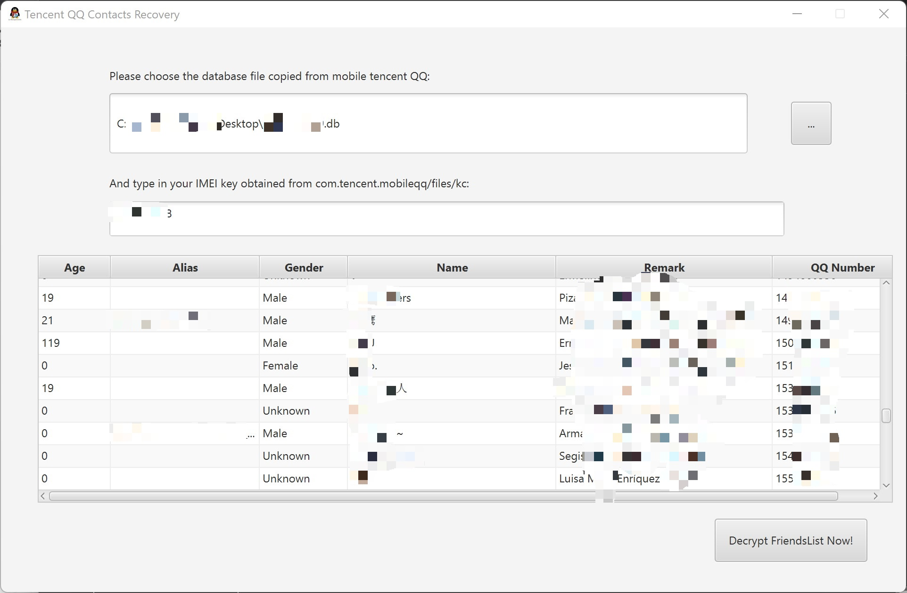

# Utilitaire de déchiffrement de la liste d'amis Tencent QQ

*Lire ceci en langue: **Français**, [简体中文](README-zh_CN.md).*

***NOTE : Le code source et le principe de fonctionnement de ce programme sont uniquement à des fins de recherche et d'utilisation en cas d'urgence pour récupérer des données lorsque le compte est bloqué. NE L'UTILISEZ PAS À DES FINS ILLÉGALES. Toutes les conséquences légales qui en découlent n'ont RIEN à voir avec moi !*** 

Un de mes amis chinois a récemment vu son compte QQ bloqué sans raison apparente, et il n'a pas pu le débloquer, ce qui l'a empêché de contacter ses contacts importants pendant cette période.

Pour résoudre son problème, j'ai effectué une rétro-ingénierie du logiciel QQ pour le client Android, étudié l'emplacement de son stockage de base de données et l'algorithme de chiffrement de ses champs, et ai ainsi récupéré les surnoms, les numéros d'identification, les noms de notes, les âges, les genres et diverses autres informations des contacts mis en cache par le mobile QQ. Cela facilite grandement la récupération des contacts importants, car nous pouvons ajouter des amis via le compte QQ auxiliaire.

Maintenant, je partage cet utilitaire avec vous pour vous aider à traverser une période difficile. 😊

------

### Comment l'utiliser :

1. Accordez des autorisations root à votre système Android, puis installez un logiciel d'exploration de fichiers qui peut parcourir les fichiers et dossiers protégés par "root" (par exemple, MT Manager, Root Explorer, ES Explorer, etc.).
2. Allez dans le dossier "/data/data/com.tencent.mobileqq/databases" et trouvez le fichier de base de données appelé "\<qqid\>.db", où qqid est votre numéro QQ.
3. Ensuite, passez au dossier "/data/data/com.tencent.mobileqq/files" et ouvrez le fichier appelé "kc" en tant que texte brut. Notez ou copiez le contenu de ce fichier (généralement, le contenu du fichier se compose de chiffres purs, calculés à partir des numéros IMEI de toutes les cartes SIM de votre téléphone).
4. Ouvrez mon logiciel, remplissez le chemin du fichier (ou choisissez-le via la boîte de dialogue en cliquant sur le bouton) et la clé, et vous verrez finalement le contrôle TableView à l'écran avec les données déchiffrées déjà affichées.

------

### Capture d'écran :

